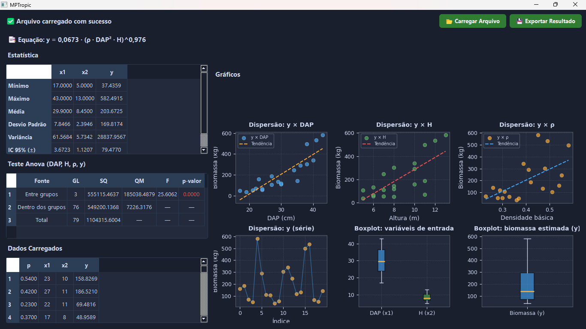

# model_forest_biomass
Protótipo de aplicação do modelo Pantropical de cálculo de biomassa, com processamento automático e visualização para desktop

Aplicação desktop desenvolvida em Python para processamento e análise de dados experimentais de biomassa através da equação alométrica de Chave et al., (2014). O software permite carregar planilhas aplicando a equação automaticamente, visualizar os resultados e exportar os dados processados. O processamento é eficaz para dados experimentais de inventário florestal, quantificação de biomassa acima do solo para estudos de licenciamento dentre outros fins.

# Equação:

  y = 0,0673 * (ρ * DAP^2 * H)^0,976

y = biomassa (kg)
ρ = densidade básica da espécie
DAP = diâmetro a 1,3m (cm)
H = altura da espécie (m)

# Funcionalidades
- Leitura de arquivos CSV/XLSX
- Aplicação da equação
- Visualização dos dados
- Gráfico das variáveis
- Exportação de resultados

# Interface

# ⚠️ A planilha de entrada deve conter as colunas x1 (DAP), x2 (H) e p (densidade básica).

# Tecnologias utilizadas

* Python
* PyQt5
* Pandas
* Matplotlib

# Como abrir
Você pode baixar aqui: https://github.com/seu_usuario/seu_repo/releases

1. Baixe o arquivo `app.exe`
2. Execute o programa
3. Carregue sua planilha

#📄 Licença
Este projeto está licenciado sob a licença MIT.

# Referências
Chave, J., Réjou-Méchain, M., Búrquez, A., Chidumayo, E., Colgan, M.S., Delitti, W.B.C., Duque, A., Eid, T., Fearnside, P.M., Goodman, R.C., Henry, M., Martínez-Yrízar, A., Mugasha, W.A., Muller-Landau, H.C., Mencuccini, M., Nelson, B.W., Ngomanda, A., Nogueira, E.M., Ortiz-Malavassi, E., Pélissier, R., Ploton, P., Ryan, C.M., Saldarriaga, J.G. and Vieilledent, G. Improved allometric models to estimate the aboveground biomass of tropical trees. Global Change Biology, 20: 3177-3190. 2014. https://doi.org/10.1111/gcb.12629
